# P3.3.0 任务规范与最小模型设计

_版本 p33.0-v1.1，2026-09-13；状态：设计冻结，尚未训练_

---

本文件将 [`research_claims.md`](research_claims.md#9-p33-大规模公开数据交互先验设计已确定结果待实验)
中的研究设计落实为 P3.3.1 可以直接实现和验收的接口。机器可读配置以
[`ar_scene_v1.json`](../configs/p33/ar_scene_v1.json) 为准，样本索引结构以
[`p33_scene_v1.schema.json`](../schemas/p33_scene_v1.schema.json) 为准。本规范不改变 P2.12 的冻结方法、
阈值或已读 heldout 结论。

## 1. 范围与状态

P3.3 的目标是学习真实交通条件下的多模态交互分布，用它约束和引导安全关键场景生成，再在固定闭环
rollout 预算下选择候选。主模型为地图感知、自回归、多智能体 Transformer，代号 `AR-Scene-v1`。

本阶段只冻结：

- 任务和信息边界；
- 数据文件角色与规模阶梯；
- 场景张量、坐标系、mask 和截断规则；
- 运动 token、模型接口、训练损失与采样规则；
- 基线、指标、开发门槛和一次性确认规则。

本阶段不实现数据内容转换、不训练模型、不读取新 final-confirmation 轨迹内容，也不产生方法优越性
结论。所有数字结果仍以现有 P2.12 证据为准。

## 2. 科学任务

```mermaid
flowchart LR
    accTitle: P3.3 evidence pipeline
    accDescr: Public trajectories train a nominal traffic model, simulation attempts train safety guidance, a budget selector chooses candidates, and ABD parameters perturb the closed-loop evaluation before visualization.

    public_data[(Waymo and INTERACTION)] --> nominal_model[Train nominal traffic model]
    nominal_model --> nominal_candidates[Sample plausible candidates]
    simulation_attempts[(Training CEM attempts)] --> safety_guidance[Train risk and feasibility guidance]
    nominal_candidates --> safety_guidance
    safety_guidance --> candidate_bank[(Freeze M16 candidate bank)]
    candidate_bank --> budget_selector[Select K1 or K2]
    budget_selector --> closed_loop[Run scenario_lab closed loop]
    abd_domain[(ABD sensitivity domain)] --> closed_loop
    closed_loop --> evidence{Development gates pass?}
    evidence -->|Yes| final_confirmation[Run one final confirmation]
    evidence -->|No| negative_result[Record failure and stop]
    final_confirmation --> visualization[Create 2D and CARLA replay]

    classDef data fill:#f3f4f6,stroke:#6b7280,stroke-width:2px,color:#1f2937
    classDef process fill:#dbeafe,stroke:#2563eb,stroke-width:2px,color:#1e3a5f
    classDef decision fill:#fef9c3,stroke:#ca8a04,stroke-width:2px,color:#713f12
    classDef result fill:#dcfce7,stroke:#16a34a,stroke-width:2px,color:#14532d

    class public_data,simulation_attempts,candidate_bank,abd_domain data
    class nominal_model,nominal_candidates,safety_guidance,budget_selector,closed_loop process
    class evidence decision
    class final_confirmation,visualization,negative_result result
```



### 2.1 T1：真实交通建模

输入公开数据的历史轨迹、矢量地图和显式 mask，生成未来 5 s 的联合多智能体轨迹分布。T1 必须证明
模型在 Waymo dev 和 INTERACTION dev 上均超过最强的 constant-velocity/P1 GRU 基线。

### 2.2 T2：安全关键生成

从 T1 名义分布采样或在 motion-token 空间引导，使候选向指定 TTC、near/contact 或风险强度移动。
风险与可行性监督只来自训练域仿真 attempts。真实度下限取真实 train 轨迹 log-likelihood 的第 5
百分位；该阈值不得使用 dev 或 final 数据拟合。

### 2.3 T3：预算化选择

每个初始条件固定生成 `M=16` 个候选，形成不可变 candidate bank。选择器只能在 bank 上排序，正式
闭环预算为 `K=1` 或 `K=2`。生成成本、排序成本、闭环 rollout 和 CEM 搜索成本分别报告。

## 3. 数据角色与划分

| 来源 | 参数学习 | 开发评价 | 一次性确认 | 不承担的角色 |
|---|---|---|---|---|
| Waymo | 1,000 个 training shard 内的 hash-train Scenario | 同 shard 的 hash-dev Scenario；已读 validation 00000/00001 | validation 00002–00149 | 实车 AEB 响应标签 |
| INTERACTION | 六个 train 地点的原始 CSV | 两个 dev 地点的原始 CSV | 四个未见地点、35 个文件 | ECU request/active 标签 |
| CEM attempts | 风险、可行性、候选成对排序 | 新开发条件 | 新仿真 confirmation | 真实交通概率 |
| ABD | 不训练 NPC 生成器 | 响应敏感性设计 | 冻结分布下稳定性 | NPC 行为和碰撞真值 |

Waymo Motion Dataset 的 Scenario 形式同时提供多智能体轨迹和矢量地图，并区分 training、validation、
test；本项目只使用本地已有且列入 inventory 的文件。[^1]

Waymo training Scenario 使用：

```text
digest = sha256("p33-waymo-v1\x1f" + scenario_id)
bucket = first_uint64(digest) * 100 // 2**64
train  = bucket 0..89
dev    = bucket 90..99
```

同一 Scenario 的所有 anchor、agent 和时间窗继承同一 split。INTERACTION 以 `(location, case_id)` 为
独立组，同组不得跨 split。公开数据的重叠窗口不能被当成独立 bootstrap 单位。

规模阶梯如下：

| 阶段 | Waymo training | INTERACTION development | 决策权限 |
|---|---:|---:|---|
| smoke | 10 shard | 每个开发地点至多 2 个记录 case | 只能修工程错误 |
| architecture | 100 shard | 每地点 hash 顺序前 25% | 允许选模型和表示 |
| scale | 500 shard | 全部 338 个开发文件 | 允许冻结超参数 |
| full | 1,000 shard | 全部 338 个开发文件 | 三种子正式训练 |
| final confirmation | 148 个 validation shard | 35 个 location-heldout 文件 | 只评价一次 |

Waymo 文件子集按 `sha256(selection_salt + relative_path)` 排序，保证 10/100/500/1000 为嵌套子集。
INTERACTION 原始文件没有 `case_id` 列，因此以文件名末尾编号定义记录 case；同一地点、同一编号的
`vehicle_tracks` 与 `pedestrian_tracks` 必须作为一个选择单元，禁止拆到不同规模阶段。P3.3.0 只清点
路径和大小；development 文件的内容 SHA-256 在 P3.3.1 流式读取时计算，final 文件只在正式确认时
计算。实际读取的开发地点 OSM 地图作为外部依赖另行记录内容哈希。

## 4. 场景样本契约

### 4.1 时间和坐标

- 历史：11 帧，`t=-1.0,-0.9,...,0.0 s`
- 未来：50 帧，`t=0.1,0.2,...,5.0 s`
- 坐标原点：anchor 在 `t=0` 的包围盒中心
- x 轴：anchor 在 `t=0` 的朝向
- y 轴：anchor 左侧
- 单位：m、s、rad、m/s

世界坐标到局部坐标的变换为：

$$
\mathbf{p}_{local}=R(-\psi_0)(\mathbf{p}_{world}-\mathbf{p}_0),
\qquad
\mathbf{v}_{local}=R(-\psi_0)\mathbf{v}_{world}.
$$

每条样本保存 `origin_x_m`、`origin_y_m` 和 `yaw_rad`，使轨迹可以无损变换回原坐标。G0 要求正反
变换最大绝对误差不超过 `1e-5 m`。

### 4.2 Anchor 与 agent 顺序

Waymo 使用 `sdc_track_index` 作为 anchor。INTERACTION 对每个 case 最多选择 8 个具有完整监督窗的
车辆 anchor，按当前帧最近非车辆距离、最近车辆距离和稳定 track ID 排序。future 只能决定监督是否
存在，不能参与 anchor 或邻居的相关性排序。

slot 0 固定为 anchor，其后依次放入 `objects_of_interest`、`tracks_to_predict`，剩余 agent 按当前
距离升序、闭合速度降序、track ID 排序。最多保留 16 个 agent；所有截断都写入样本和数据卡。

### 4.3 地图顺序

保留 anchor 80 m 内的 lane center、lane/road boundary、crosswalk、stop line、speed bump 和 other
polyline。按与 anchor 的最小点距离、map type、稳定 feature ID 排序，最多 64 条，每条重采样到最多
20 点。地图选择不得使用 future 轨迹。

### 4.4 数组与 dtype

| 数组 | shape | dtype | 语义 |
|---|---|---|---|
| `agent_history` | `[16,11,8]` | float32 | x/y、vx/vy、cos/sin heading、length/width |
| `state_valid_mask` | `[16,11]` | bool | 原始状态存在且数值有效 |
| `pairwise_visibility_mask` | `[16,11,16]` | bool | query、time、source-agent 可见性 |
| `agent_present_mask` | `[16]` | bool | agent slot 已分配 |
| `agent_type` | `[16]` | uint8 | pad/vehicle/pedestrian/cyclist/other |
| `agent_role` | `[16]` | uint8 | pad/anchor/prediction-target/context |
| `map_polylines` | `[64,20,6]` | float32 | x/y、方向、曲率、限速 |
| `map_point_mask` | `[64,20]` | bool | 地图点存在 |
| `map_type` | `[64]` | uint8 | 地图要素类型 |
| `future_xy` | `[16,50,2]` | float32 | 连续未来监督 |
| `future_valid_mask` | `[16,50]` | bool | future 状态有效 |
| `motion_token_target` | `[16,10]` | uint8 | 0–127；无效位置为 255 |
| `motion_token_valid_mask` | `[16,10]` | bool | token 有完整 0.5 s 监督 |

所有 invalid/padded 浮点位置必须填零，pad type/role 为 0，motion-token ignore index 为 255。NaN/Inf
直接使分片失败，不在训练时静默替换。

### 4.5 可见性边界

`state_valid_mask` 只表示数据存在，不能称为物理可见。公开数据使用有明确局限的
`geometric_proxy_version_1`：距离超过 80 m 或 query-source 中心连线穿过膨胀 0.2 m 的第三方动态
actor 有向包围盒时，source 对 query 不可见；该版本不声称处理建筑物遮挡。

模型为每个 query agent 构造 `[time,source-agent,feature]` 视图，先用 pairwise visibility mask 将隐藏
source 的历史置零，再进入 attention。`scenario_lab` 闭环改用环境产生的 actor-visible mask。完整原始
轨迹可以保存在监督张量中，但不能通过缓存、残差连接或聚合 token 泄漏到 actor 输入。

## 5. 运动 token

每个 token 表示 0.5 s、5 个 10 Hz 点的 agent-local `delta_xy`，原始向量维度为 10。codebook 由
train split 上 source×agent-type 平衡抽样后使用 mini-batch k-means 学习，词表大小固定为 128，随机
种子为 7。

训练 codebook 前固定：抽样上限、每来源/类型配额、k-means batch、迭代数和收敛条件，并写入
codebook manifest。dev/final 轨迹不得参与质心初始化、标准化或重拟合。模型同时输出 token logits 和
连续 `delta_xy` residual，以减少量化误差。

## 6. AR-Scene-v1 接口

模型按 0.5 s 时间块自回归；同一时间块内的 active agents 并行输出 token，完成采样后统一更新状态，
避免由 agent ID 顺序引入非物理优先级。离散地图/运动 token 加 next-token prediction 的总体选择参考
SMART 的可扩展多智能体仿真范式，但本项目的 token、可见性约束、安全引导和评价协议独立定义。[^2]

```text
encode_context(batch) -> context
forward(context, teacher_tokens) -> token_logits, delta_xy_residual
rollout(context, num_samples=6, temperature=1.0, top_p=0.95,
        clamped_agent_mask=None) -> trajectories, token_log_prob
score(context, candidate_trajectories) -> nominal_log_likelihood
```

最小结构：

| 参数 | 冻结值 |
|---|---:|
| `d_model` | 256 |
| Transformer layers | 6 |
| attention heads | 8 |
| FFN dimension | 1024 |
| dropout | 0.1 |
| normalization | pre-layer norm |
| activation | GELU |
| 目标参数量 | 10M–25M |

地图点先经共享 MLP 编码并在 polyline 内 masked pooling；agent history 经时间编码；随后执行
agent-agent 和 agent-map attention。source、agent type 和 role 使用独立 embedding。

训练损失固定为：

$$
\mathcal{L}_{T1}=\mathcal{L}_{CE}
+0.5\,\mathcal{L}_{Huber,traj}
+0.2\,\mathcal{L}_{Huber,FDE}.
$$

所有损失按有效 agent/time mask 归一化；mini-batch 在 Waymo/INTERACTION 之间平衡，并记录实际来源和
agent-type 权重。训练最多 30 epochs，warmup 5%，AdamW、学习率 `3e-4`、weight decay `0.01`，按
source-macro `minADE@6` 早停，patience 为 5。正式 full 使用种子 7、17、27。

## 7. 安全引导和选择器接口

T1 模型先冻结。风险/可行性模块读取初始可见历史、生成 token、候选轨迹和允许的静态场景属性，输出：

- `p_valid`
- `p_dangerous_given_valid`
- pairwise ranking utility

风险权重只在 `{0,0.25,0.5,1.0,2.0}` 网格上开发。若需要更新名义模型，学习率不得超过 T1 的 0.1
倍，并必须重新检查 G1。最小版本禁用 PPO。

候选库记录模型哈希、codebook 哈希、condition ID、采样 seed、16 个候选、每个候选 nominal log-prob
及生成成本。选择器不能执行候选后再改变同条件排序。

## 8. 指标、基线与门槛

T1 主指标固定为 `minADE@6`；同时报告 `minFDE@6`、motion-token NLL、闭环碰撞、offroad、加速度和
jerk 违规率。T2 主指标为 `condition_has_valid_dangerous_candidate@M16`。T3 主指标沿用条件级
`complete && valid && dangerous` 覆盖率。

| Gate | 通过条件 |
|---|---|
| G0 | 流式/断点续跑、内容哈希、零跨 split、有限数值、坐标可逆、mask 泄漏测试全部通过 |
| G1 | 两个来源分别相对最强基线改善 `minADE@6 >=5%`，配对聚类 bootstrap 95% CI 下界大于 0；minFDE 不劣；主要运动学违规率增加不超过 1 个百分点 |
| G2 | M16 引导覆盖率高于名义采样且 CI 下界大于 0；真实度下降不超过 5%；角色违规为 0 |
| G3 | K1/K2 对最强等预算固定/随机基线分别报告，single/dual 均不得被合并均值掩盖 |
| G4 | 三种子、完整 manifest/hash/命令/运行环境及种子离散度齐备 |

最小样本量：Waymo dev 至少 5,000 个独立 Scenario；INTERACTION dev 至少 100 个
`(location,case_id)` 组；仿真 development 和 confirmation 各至少 400 条件/分支。bootstrap 固定
`B=5000`，Waymo、INTERACTION 和仿真的聚类单位分别为 Scenario ID、`(location,case_id)` 和初始条件。

基线和消融完整清单见 `research_claims.md` 9.6。模型选择只能发生在 development；G0–G4 和样本量
满足后才可读取新的 final confirmation。任何阈值、数据划分或主指标修改都必须提升 spec version，
并发生在 final 数据读取之前。

## 9. 可视化与重放

所有最终入库及 K1/K2 选中的场景必须输出二维逐帧动画和 CARLA 三维视频。第一阶段 CARLA 采用确定性
运动学重放，并检查轨迹、最小间距和事件时间与 `scenario_lab` 日志一致；CARLA 物理闭环属于独立的
跨仿真器实验。可视化不能用于删除失败条件、改变排序或重跑 confirmation。

## 10. P3.3.0 完成定义

P3.3.0 只有在以下工件同时存在并通过测试后完成：

- 本任务规范；
- 机器可读冻结配置；
- scene-shard-v1 索引 schema；
- 1,523 个公开数据文件的 metadata-only inventory；
- 配置、schema、inventory 和冻结指纹；
- 配置/划分/张量/mask 单元测试；
- `SPEC_VALIDATION.json` 的全部检查为 pass。

完成 P3.3.0 只允许进入 P3.3.1 流式数据管线，不等于数据转换、模型训练或科学 gate 已通过。

## 参考资料

[^1]: Waymo LLC. “Motion Dataset.” Waymo Open Dataset. https://waymo.com/open/data/motion/

[^2]: Feng, X. et al. “SMART: Scalable Multi-agent Real-time Simulation via Next-token Prediction.” _NeurIPS 2024_. https://openreview.net/forum?id=2uy3LZHNIG
