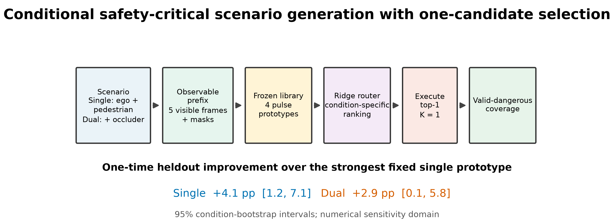
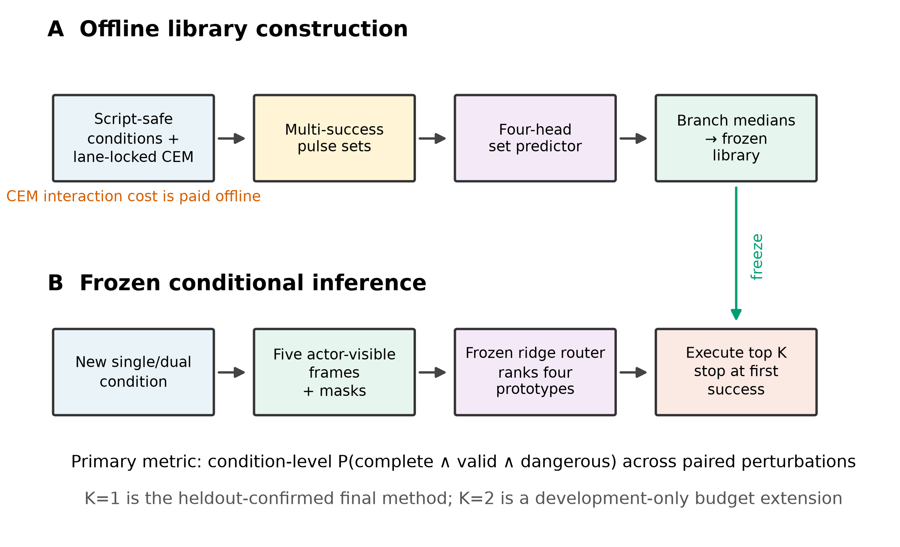
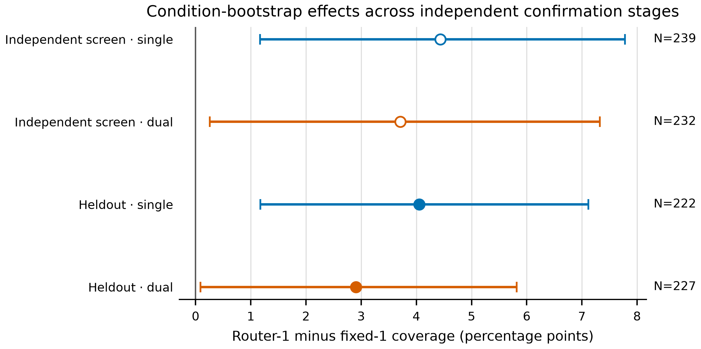
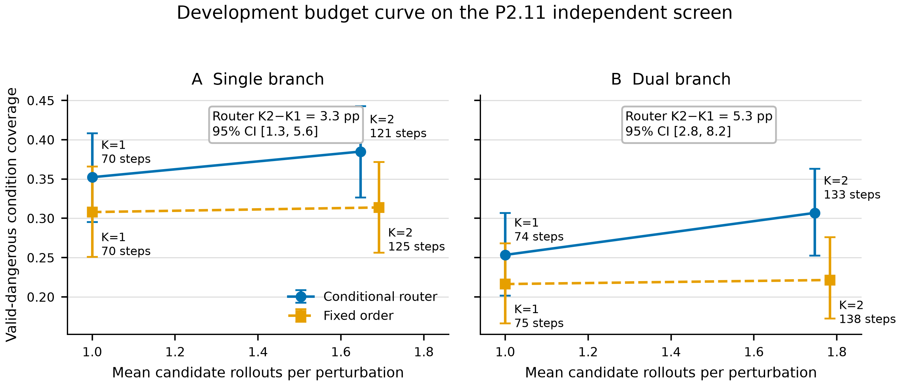
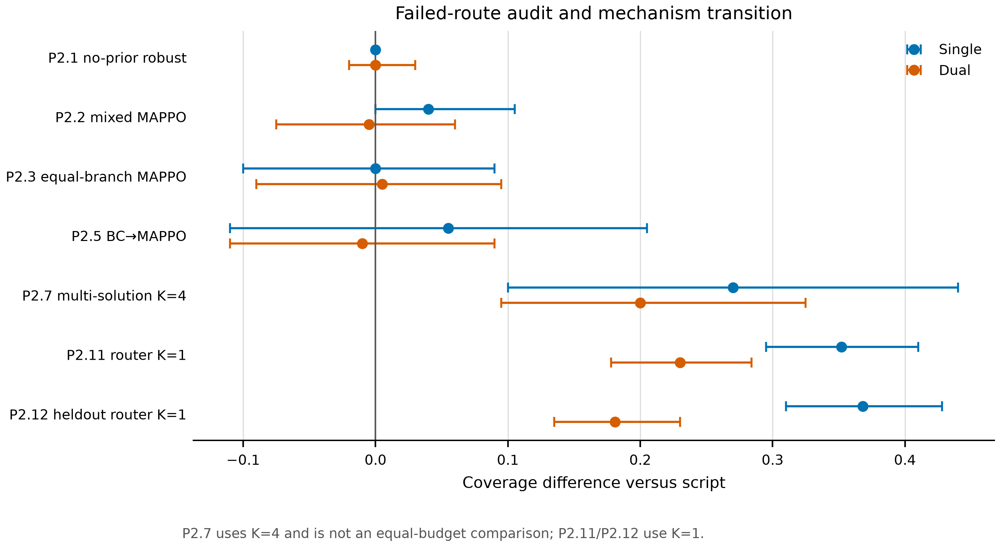

# 条件化安全关键场景生成：从多解原型库到预算化候选选择

**Conditional Safety-Critical Scenario Generation through Multi-Solution Prototypes and Budgeted Candidate Selection**

## 摘要

安全关键交通情形稀少、结果多模态，而且候选动作必须经过闭环仿真才能判断是否既有效又危险。直接训练单个强化学习策略或回归单组动作参数，容易把不同条件下的可行解平均掉；逐条件在线搜索虽然能找到危险解，却需要大量仿真交互。本文提出一种两阶段方法：首先在 lane-locked 动作约束下用交叉熵方法离线发现多组成功脉冲，并通过四头集合预测器压缩为 single-target 与 dual-target 两个正式分支各自的冻结四原型库；随后，仅使用场景开始后的五帧参与者可见历史以及 visibility/presence mask，由分支特定的岭回归路由器排序原型，并在预算 \(K\) 内依次执行，遇到首个有效危险结果即停止。主要指标是条件级有效危险覆盖率，所有未完成、无效或角色违规的尝试均按失败计入分母。在独立开发屏上，等预算 \(K=1\) 路由相对最强固定单原型在 single 和 dual 分支分别提高 4.44 和 3.71 个百分点；在唯一一次预注册 heldout 确认中，相应增益为 4.05 个百分点，95% CI [1.17, 7.12]，以及 2.91 个百分点，95% CI [0.09, 5.82]。开发期预算曲线显示，从 \(K=1\) 增至 \(K=2\) 时，路由器在 single 和 dual 分支又分别提高 3.26 和 5.34 个百分点，但平均增加 50.6 和 58.6 个决策步。连续记录的失败路线表明，关键改进来自保留多解并根据条件选择候选，而非继续增加同一 PPO/MAPPO 配方的训练量。结论限定于本文仿真数值敏感性域内的场景级候选选择，不构成连续闭环策略、AEB 标定分布、车型泛化或实车安全性的证明。

**关键词：** 安全关键场景生成；条件路由；多解学习；候选预算；交叉熵方法；自动驾驶测试

## 1 引言

自动驾驶系统的安全评价面临一个基本稀缺性问题：自然驾驶数据能够描述常见行为，却很少包含足以暴露被测系统弱点的临界交互。仿真中的安全关键场景生成因此被表述为搜索、强化学习、对抗优化或生成建模问题。Adaptive Stress Testing 将环境扰动构造成序贯决策过程以搜索高概率失效事件 [1]；AdvSim、Learning to Collide 和 STRIVE 分别从轨迹优化、自适应生成与学习交通先验等角度提高事故或近事故情形的发现能力 [2–4]。这些工作说明了学习式或优化式生成的潜力，也暴露了两个实际问题：一是不同初始条件往往对应多个彼此分离的危险解，二是生成器的价值必须连同仿真调用预算一起报告。

本研究从一个更受约束的场景生成任务出发。参与者沿预定车道运动，生成器通过有限维脉冲参数改变目标参与者的纵向行为。single 分支包含自车和行人，dual 分支额外包含移动遮挡者；两个分支都作为正式问题报告。我们起初试图训练一个闭环 PPO/MAPPO 策略优于零动作脚本。预注册开发实验没有支持这一目标：种子方差、角色无效和策略坍缩掩盖了可能的收益，增加训练量、改变先验、拆分网络或平衡分支暴露均未产生稳定优势。逐条件 CEM 随后证明危险解确实存在，但其计算成本无法作为单次部署方法。单教师行为克隆和单输出参数预测仍然失败，由此把研究问题从“能否学到一个统一动作”转向“能否保留少量可执行解，并对新条件选择最合适的一个”。

本文围绕三个研究问题组织。RQ1 询问多解原型是否能把逐条件搜索发现的可行性转化为可复用候选集合。RQ2 询问在严格相同的单候选预算下，初始历史条件化路由是否优于最强固定原型和零动作脚本。RQ3 询问预算从一个候选增加到两个候选时，覆盖率的边际收益与仿真成本如何变化。我们的贡献是：构造了一个同时支持 single 和 dual 分支、显式遮挡与角色有效性约束的闭环评测协议；提出了“离线多解原型库加冻结条件路由”的轻量方法；通过独立开发屏和唯一一次预注册 heldout 评价确认 \(K=1\) 的等预算增益；并完整保留失败路线，使方法转向可以由负结果直接解释，而非只展示最终成功配置。

## 2 相关工作

安全关键场景生成大致包含概率导向的稀有事件搜索、对抗式场景优化、数据驱动生成和测试基准四条脉络。Adaptive Stress Testing 使用强化学习或树搜索寻找最可能导致失效的环境扰动 [1]。AdvSim 直接优化可执行交通参与者轨迹，以挑战被测驾驶系统 [2]；Learning to Collide 强调根据被测系统的反馈自适应生成碰撞场景 [4]；DriveFuzz 通过驾驶质量反馈引导模糊测试 [10]。这类方法与本文的共同点是把闭环系统响应纳入场景生成，但逐条件优化通常需要许多仿真调用。

另一类工作使用真实交通数据或学习先验约束生成结果。STRIVE 从真实轨迹学习交通先验并生成事故倾向场景 [3]。Waymo Open Motion Dataset 和 INTERACTION 提供大规模交互轨迹与语义地图，为行为建模、预测和场景初始化提供数据基础 [6,7]。本文未把这些公开数据与仿真危险标签混成统一监督信号；最终确认的方法只使用本文生成的可见历史与离线搜索结果。这样做牺牲了对自然度的外部验证，却保持了“行为资料、危险结果与实测校准证据”之间的边界。

Scenic 提供概率化场景描述和生成语言 [8]，ScenarioNet 致力于跨数据集的大规模场景表示与仿真 [9]，SafeBench 则在统一平台内比较多类安全关键场景和驾驶算法 [5]。这些平台工作说明，可比性依赖明确的场景定义、预算、失效判据和重复采样。本文的重点不在建立通用平台，而在一个固定模拟器中研究候选集合大小与条件路由的作用。交叉熵方法为离线连续参数搜索提供了直接工具 [11]；我们使用它证明并收集可行解，但不把高交互成本的 CEM 结果作为与单候选方法等预算的主比较。

## 3 问题定义

令场景条件 \(x_i\) 包含几何、参与者初态和角色配置。single 分支有自车与行人，dual 分支还包括移动遮挡者。生成动作是 lane-locked 脉冲参数，参与者不会通过动作离开指定车道。对每个条件采样数值扰动 \(\xi_{ir}\)，并执行候选 \(h\)。一次尝试的结果定义为

\[
z_{ihr}=\mathbf{1}\{C_{ihr}\land V_{ihr}\land D_{ihr}\},
\]

其中 \(C\) 表示仿真完整结束，\(V\) 表示没有初始碰撞、角色违规或其他无效原因，\(D\) 表示发生碰撞或最小包络间距小于 0.5 m。无效尝试不会从分母删除，而是令 \(z=0\)。对给定排序 \(\pi_i\) 和预算 \(K\)，条件级覆盖分数为

\[
s_i(K)=\frac{1}{R}\sum_{r=1}^{R}\max_{1\leq k\leq K}z_{i,\pi_i(k),r},
\]

总体覆盖率为 \(\bar{s}(K)=N^{-1}\sum_i s_i(K)\)。实际执行在每个扰动内按排序尝试候选，并在首次 \(z=1\) 时停止，因此成本同时报告平均候选 rollout 数和平均决策步数。主比较使用 \(K=1\)，路由器与固定原型各执行一次，零动作脚本同样执行一次。

纳入评价的条件必须在名义、无扰动的零动作脚本运行中完整、有效且安全。这个条件筛选只依赖预先定义的名义脚本，不查看路由器、固定原型或扰动后脚本的结果。该设计把问题限定为：生成器能否在原本名义安全的条件上制造有效危险情形，同时避免通过剔除失败或无效尝试抬高比例。

## 4 方法

### 4.1 离线多解发现与原型库

图 1A 展示离线阶段。我们首先在名义脚本安全条件上运行 lane-locked CEM。CEM 在连续脉冲参数空间中迭代采样、闭环执行、选择精英并更新采样分布，保留所有可重放的完整、有效且危险解。P2.4 的可行性实验表明，参数搜索在 single 和 dual 分支相对脚本分别提高 0.440 和 0.335 的覆盖，轨迹搜索分别提高 0.595 和 0.530；代价是每个条件约需 1395–2487 个决策步，远高于固定候选单次约 70 步。因此 CEM 只承担离线发现作用。

每个条件可能有多个成功参数。四头集合预测器接收条件特征并输出四组脉冲，使用置换不变的集合匹配损失兼顾对成功解集合的覆盖和预测精度。直接单输出回归在 P2.6 中无法同时通过两个分支，而四候选集合在 P2.7 的开发评价中达到 single 0.520、dual 0.550 的覆盖，高于脚本的 0.250 和 0.350。这一结果不是等预算优势，因为集合方法允许四次候选执行；它只用于确认“保留多解”是有效机制。

最终原型库从 P2.7 验证集合损失最优的 seed 47 模型获得。模型对训练语料输出四个头，分别在 single 和 dual 条件内取各头参数中位数，形成两个分支各四个固定、可执行的原型。建库完成后，原型参数冻结，不在后续独立屏或 heldout 上更新。

### 4.2 基于可见历史的条件路由

图 1B 展示推理阶段。路由器观察新条件开始后的五个决策帧，即 10 Hz 控制频率下约 0.5 s 的历史。特征只包含各 actor 当时可见的状态以及 visibility/presence mask；被遮挡目标不会用真实状态回填。该输入表达允许 single 与 dual 分支共享格式，同时明确区分“参与者不存在”和“参与者存在但不可见”。

对每个分支，我们为每个训练条件和每个原型估计三次配对扰动下的有效危险率，并以此作为四维监督分数。岭回归分别预测四个原型的条件分数，再按预测值降序得到 \(\pi_i\)。正则系数从 \(\{0.01,0.1,1,10,100\}\) 中按验证均方误差选择；single 选择 10，dual 选择 100。训练阶段共有 110 个 single 和 100 个 dual 合格条件，按固定索引规则划分为 88/22 与 81/19 个训练/验证条件。比较基线使用训练成功率最高的固定原型 head 1；固定 \(K=2\) 的顺序为 head 1 后接 head 3。

该路由器是场景级候选选择器。它利用初始历史决定完整 episode 使用哪个冻结脉冲原型，但不在 episode 内连续重新规划，也不是分散式多智能体策略。因此本文所说的“条件化”指初始历史条件化选择，而不是连续闭环 actor 的在线控制。

## 5 实验协议

模拟器以 50 Hz 更新动力学、以 10 Hz 接受决策。场景采样器版本固定为 v2。每个合格条件使用 \(R=5\) 个配对数值扰动，候选与脚本共享扰动索引，以降低比较方差。扰动配置在历史上可复现，但由于原始车辆试验没有 AEB request/active CAN 通道，而且部分晚触发运行存在驾驶员制动接管，它只能解释为数值敏感性域。本文不把它称作 AEB 标定分布，也不从这些运行推断车型或车队总体分布。

P2.11 独立开发屏使用 seed 76000，每个分支生成 360 个条件；名义脚本筛选后得到 239 个 single 和 232 个 dual 条件。P2.12 在模型、原型库、预算、阈值、样本量与统计代码全部冻结后，使用 seed 77000 各生成 360 个 heldout 条件，得到 222 个 single 和 227 个 dual 条件。这是唯一一次最终 heldout 尝试；完成后不允许更换 seed、预算、分母或判据，也不运行 heldout \(K=2\) 来补强结论。旧的 seed 41000 条件因不符合最终最小样本协议而保持封存。

主统计量是条件级配对差。95% 置信区间通过对条件进行 5000 次 bootstrap 获得。负对照在每个分支内将冻结路由器的 top-1 分配跨条件置换 5000 次，检验收益是否来自条件与原型的对齐，而非原型总体频率。每个分支的预注册门槛要求：至少 220 个合格条件；router-1 相对 fixed-1 和 script 的 bootstrap 下界均严格大于零；相对置换均值的实际增益至少 0.05 且单侧 \(p\leq0.05\)；候选有效率至少 0.8；角色违规为零；top-1 至少使用两个不同原型且众数占比不超过 0.9。两个分支必须同时通过。

RQ3 的 \(K=1/K=2\) 预算曲线只在 P2.11 独立开发屏上整理。对每个条件和同一组五个扰动，分别按路由排序与固定顺序执行一个或至多两个候选，并计算覆盖增量、额外 rollout、额外决策步和每个额外 rollout 的覆盖增量。由于 P2.12 已经解封，本文不把任何事后 heldout \(K=2\) 计算称为确认性证据。

## 6 结果

### 6.1 等预算单候选主结果

表 1 和图 3 给出 RQ2 的主结果。在 P2.11 独立屏上，single 分支 router-1 覆盖率为 0.352，fixed-1 为 0.308，差值 0.044，95% CI [0.012, 0.078]；dual 分支分别为 0.253 和 0.216，差值 0.037，95% CI [0.003, 0.073]。路由器相对脚本的差值为 single 0.352 和 dual 0.230，区间均严格高于零。两分支的置换检验也通过，候选有效率分别为 1.000 与 0.959，角色违规为零。

在唯一一次 heldout 确认中，single 分支 router-1 为 0.368、fixed-1 为 0.327，差值 0.041，95% CI [0.012, 0.071]；dual 分支 router-1 为 0.204、fixed-1 为 0.174，差值 0.029，95% CI [0.001, 0.058]。相对脚本的 heldout 差值分别为 0.368，95% CI [0.310, 0.428]，以及 0.181，95% CI [0.135, 0.230]。相对分支内置换分配的增益为 0.114 和 0.057，单侧置换检验均为 \(p=0.0002\)。两个分支满足全部预注册门槛。

| 划分 | 分支 | N | router-1 | fixed-1 | script | router−fixed [95% CI] | router−script [95% CI] | 置换增益 (p) | 有效率 |
|---|---|---:|---:|---:|---:|---:|---:|---:|---:|
| P2.11 独立屏 | single | 239 | 0.352 | 0.308 | 0.000 | 0.044 [0.012, 0.078] | 0.352 [0.295, 0.410] | 0.110 (0.0002) | 1.000 |
| P2.11 独立屏 | dual | 232 | 0.253 | 0.216 | 0.023 | 0.037 [0.003, 0.073] | 0.230 [0.178, 0.284] | 0.068 (0.0002) | 0.959 |
| P2.12 heldout | single | 222 | 0.368 | 0.327 | 0.000 | 0.041 [0.012, 0.071] | 0.368 [0.310, 0.428] | 0.114 (0.0002) | 1.000 |
| P2.12 heldout | dual | 227 | 0.204 | 0.174 | 0.022 | 0.029 [0.001, 0.058] | 0.181 [0.135, 0.230] | 0.057 (0.0002) | 0.942 |

### 6.2 RQ3：K=1/K=2 预算曲线

图 2 和表 2 显示，在 P2.11 的相同条件与扰动上，增加第二候选对条件路由的作用明显大于对固定顺序的作用。single 分支的 router 覆盖率从 0.352 增至 0.385，增量 0.0326，95% CI [0.0134, 0.0561]；平均 rollout 从 1.000 增至 1.648，平均决策步从 70.1 增至 120.7。fixed 顺序的覆盖率只从 0.308 增至 0.314，增量 0.0059，95% CI [0, 0.0142]。按每个额外 rollout 归一化，router 的增益为 0.0504，fixed 为 0.0085。

dual 分支的 router 覆盖率从 0.253 增至 0.307，增量 0.0534，95% CI [0.0284, 0.0819]；平均 rollout 从 1.000 增至 1.747，平均决策步从 73.9 增至 132.6。fixed 顺序从 0.216 增至 0.222，增量 0.0052，95% CI [0.0009, 0.0112]。每个额外 rollout 的增益分别为 0.0716 和 0.0066。由此可见，第二候选并非单纯依靠重复执行提升覆盖；路由排序把互补原型放到前两位，尤其有利于 dual 分支。

| 分支 | 方法 | K | 覆盖率 [95% CI] | 平均 rollout | 平均决策步 | 有效率 |
|---|---|---:|---:|---:|---:|---:|
| single | router | 1 | 0.352 [0.295, 0.408] | 1.000 | 70.1 | 1.000 |
| single | router | 2 | 0.385 [0.326, 0.443] | 1.648 | 120.7 | 1.000 |
| single | fixed | 1 | 0.308 [0.251, 0.366] | 1.000 | 70.2 | 1.000 |
| single | fixed | 2 | 0.314 [0.256, 0.372] | 1.692 | 125.3 | 1.000 |
| dual | router | 1 | 0.253 [0.202, 0.307] | 1.000 | 73.9 | 0.959 |
| dual | router | 2 | 0.307 [0.253, 0.363] | 1.747 | 132.6 | 0.977 |
| dual | fixed | 1 | 0.216 [0.166, 0.268] | 1.000 | 74.8 | 1.000 |
| dual | fixed | 2 | 0.222 [0.172, 0.276] | 1.784 | 137.5 | 1.000 |

K=2 提供了清晰但有成本的边际覆盖，适合将漏检代价高于额外仿真代价的离线筛选。最终方法仍选 \(K=1\)，因为其等预算收益已经在独立屏和 heldout 中确认，而 \(K=2\) 的预算曲线属于开发期分析。这个选择也使“优于固定原型”的结论不依赖更多 episode。

### 6.3 失败路线消融与机制转变

图 4 与表 3 汇总了失败路线。最初 PPO/MAPPO 三种子聚合在 single 和 dual 分支均低于脚本，并出现 seed 17 的 KL 单调上漂与角色无效集中。去除先验后训练更稳定，却没有产生覆盖优势；共享/专用网络以及 equal-branch 暴露只能达到非劣，置信区间仍跨零。该组结果反对在相同奖励与动作表达下继续追加训练量。

P2.4 的逐条件 CEM 把问题从“可能没有危险解”排除为“存在解但摊销失败”。P2.5 将单个 CEM 教师用于行为克隆再接 MAPPO，single 的差值为 0.055，95% CI [-0.110, 0.205]，dual 为 -0.010，95% CI [-0.110, 0.090]，说明开环教师没有稳定转化为闭环行为。P2.6 的直接参数预测在 single 只达到 0.269，低于预注册的 0.50 门槛；dual 虽为 0.358、超过其 0.25 门槛，但按双分支共同通过规则仍失败。P2.7 保留四个解后两个分支都恢复较高覆盖，随后 P2.8–P2.12 进一步表明，可以把高预算集合压缩为条件相关的单候选决策。

| 阶段 | 被检验机制 | single | dual | 判定 | 机制结论 |
|---|---|---|---|---|---|
| P2/P2.1 | PPO/MAPPO 先验与 robust 变体 | 无稳定增益 | 先验变体不稳 | FAIL | 不支持沿同一训练配方加量 |
| P2.2/P2.3 | 共享/专用网络与 equal-branch 预算 | 差值 0.000–0.040，CI 跨零 | 差值 -0.005–0.005，CI 跨零 | FAIL superiority | 架构与分支暴露不是主要瓶颈 |
| P2.4 | lane-locked 逐条件 CEM | 参数 +0.440；轨迹 +0.595 | 参数 +0.335；轨迹 +0.530 | PASS feasibility | 可行解存在，但交互成本高 |
| P2.5 | 单教师 BC→MAPPO | +0.055 [-0.110, 0.205] | -0.010 [-0.110, 0.090] | FAIL | 单个开环教师迁移不可靠 |
| P2.6 | 条件到单脉冲回归 | 0.269，门槛 >0.50 | 0.358，门槛 >0.25 | FAIL both-branch | 单输出丢失多模态解 |
| P2.7 | 多成功解集合，K=4 | 0.520 vs 0.250 | 0.550 vs 0.350 | PASS | 小型可执行解集恢复覆盖 |
| P2.8 | 条件路由，K=2 | router−fixed +0.041 | shuffled-control CI 跨零 | FAIL mechanism | 需要独立确认条件对齐 |
| P2.10–P2.12 | 冻结路由并压缩到 K=1 | heldout +0.041 | heldout +0.029 | PASS | 单次条件选择已足够形成稳定增益 |

这组消融不是从最终模型任意删减组件得到的传统局部消融，而是预注册机制假设的序贯检验。它提供了一条可证伪的解释链：CEM 证明解存在；单教师迁移失败说明困难不只是缺少示范；单点回归失败而集合预测成功，支持多模态假设；固定集合进一步被条件路由压缩到单候选，说明条件—原型对齐包含可泛化信号。该解释仍是由一组相继实验支持的机制推断，不等同于已识别全部因果因素。

## 7 讨论

主结果回答了“如何做到单次方法优于脚本”的一个受限版本：不要求单个连续控制策略在整个 episode 内学会所有交互，而是把昂贵的搜索经验压缩为少量闭环可执行原型，再用初始可见历史选择一次。这样既保留 CEM 发现的多模态结构，又将在线成本降到与固定原型和脚本相同的一个 episode。heldout 上 router-1 相对 fixed-1 的绝对增益只有 2.9–4.1 个百分点，但置信区间下界均为正，且两个正式分支同时通过预注册门槛。对安全关键测试而言，这是一项候选选择效率的证据，不应被扩大解释成通用学习策略优势。

RQ3 揭示了预算与覆盖之间的实际折中。第二候选给 dual 分支带来的边际收益更大，符合 dual 条件的交互结构更复杂、单一原型更难覆盖的直觉；但该解释尚未通过按几何子型分层的预注册检验。K=2 平均成本不是严格两倍，因为成功后提前停止。若任务是大规模离线筛选且每个额外发现都很重要，K=2 是合理工作点；若需要固定单次成本或强调确认性证据，K=1 更合适。

失败路线也改变了我们对“模型容量”的判断。PPO/MAPPO、网络拆分和训练暴露的调整没有稳定解决问题，而集合表示和条件路由解决了两个更直接的结构障碍：解的多模态性与条件依赖性。岭回归足以实现稳定路由，说明当前数据量下复杂路由网络并非必要。未来改进应优先扩大可执行原型的多样性、改善条件覆盖与校准排序，而不是默认增加策略网络规模。

## 8 局限性

第一，实验在自建二维闭环模拟器和 lane-locked 动作空间中完成，危险判据是碰撞或小于 0.5 m 的几何间距。结果尚未在其他模拟器、感知栈、规划器或真实车辆上复现。第二，路由器只读取前五帧并一次性选择原型，不代表连续反应式控制；当关键事件在 0.5 s 之后才显现时，它无法调整排序。第三，扰动域不是 AEB 标定分布。现有 ABD 日志缺少车辆 CAN 中的 AEB request/active/state，部分晚触发测试还有人工制动接管，因而无法把制动响应唯一归因于车辆 AEB，也无法完成车型级保留验证。

第四，P2.11 与 P2.12 的合格条件由名义脚本安全性筛选，结论适用于这一条件分布，不能直接外推到所有自然驾驶或法规场景。第五，P2.7 的 K=4 结果用于机制验证，交互预算高于脚本；它不是公平的主基线。第六，RQ3 的 K=2 曲线在独立开发屏上形成，heldout 解封后没有再计算 K=2，因此其边际增益属于开发证据。第七，固定库只有四个原型，可能无法覆盖更广的几何和动力学模式；扩大原型库将同时增加路由校准和多重选择风险。

## 9 结论

本文在 single-target 与 dual-target 两个正式分支上研究了条件化安全关键场景生成。连续的负结果表明，在相同动作表达和奖励配方下继续增加 PPO/MAPPO 训练量没有证据支持。逐条件 CEM 证明了危险解的存在，多解集合学习保留了这些解的模态结构，冻结岭回归路由则把四候选库压缩为一次条件相关选择。在等预算 \(K=1\) 下，路由器相对最强固定原型的增益在独立开发屏和唯一一次 heldout 中均为正，两个分支同时通过预注册判据。开发期 \(K=2\) 曲线进一步显示，额外候选能换取更多覆盖，尤其是在 dual 分支，但会增加约 59 个决策步。当前证据支持的论文主线是“条件化安全关键场景生成与预算化候选选择”，其有效范围是本文冻结的仿真数值敏感性协议。

## 数据、代码与证据可用性

论文数值由 scripts/build_paper_evidence.py 从完成的 P2.8、P2.10、P2.11 和 P2.12 产物只读生成。evidence/evidence_manifest.json 保存输入文件的 SHA-256、输出文件摘要和“未重跑 heldout”声明。主结果、预算曲线、失败路线与图表分别保存在 evidence/、tables/ 和 figures/。原始 ABD 数据涉及车辆试验记录，不属于本文最终确认性扰动证据。

## 参考文献

[1] Koren M, Alsaif S, Lee R, Kochenderfer M J. Adaptive Stress Testing for Autonomous Vehicles. arXiv:1902.01909, 2019.

[2] Wang J, Pun A, Tu J, et al. AdvSim: Generating Safety-Critical Scenarios for Self-Driving Vehicles. CVPR, 2021.

[3] Rempe D, Philion J, Guibas L J, Fidler S, Litany O. Generating Useful Accident-Prone Driving Scenarios via a Learned Traffic Prior. CVPR, 2022.

[4] Feng S, Yan X, Sun H, Feng Y, Liu H X. Learning to Collide: An Adaptive Safety-Critical Scenarios Generating Method. arXiv:2003.01197, 2020.

[5] Xu C, Ding W, Lyu W, et al. SafeBench: A Benchmarking Platform for Safety Evaluation of Autonomous Vehicles. NeurIPS, 2022.

[6] Ettinger S, Cheng S, Caine B, et al. Large Scale Interactive Motion Forecasting for Autonomous Driving: The Waymo Open Motion Dataset. ICCV, 2021.

[7] Zhan W, Sun L, Wang D, et al. INTERACTION Dataset: An INTERnational, Adversarial and Cooperative moTION Dataset in Interactive Driving Scenarios with Semantic Maps. arXiv:1910.03088, 2019.

[8] Fremont D J, Kim E, Pant Y V, et al. Scenic: A Language for Scenario Specification and Scene Generation. Machine Learning, 2023.

[9] Li Q, Peng Z, Feng L, et al. ScenarioNet: Open-Source Platform for Large-Scale Traffic Scenario Simulation and Modeling. arXiv:2306.12241, 2023.

[10] Kim S, Shrestha K, Tuncali C, et al. DriveFuzz: Discovering Autonomous Driving Bugs through Driving Quality-Guided Fuzzing. arXiv:2211.01829, 2022.

[11] Rubinstein R Y. The Cross-Entropy Method for Combinatorial and Continuous Optimization. Methodology and Computing in Applied Probability, 1999.
